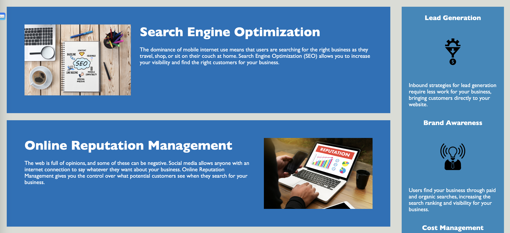
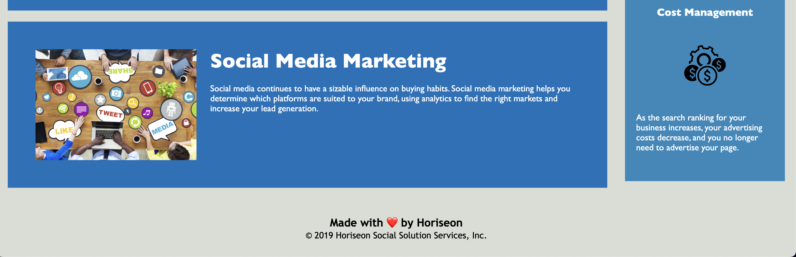

# Week One Challenge

## Description

This website was built to provide an overview of what Horiseon Social Solution Services provides. Building this site we wanted to provide a simple and easy to use experience to showcase the different services in detail and allow new potential clients to understand who we are and what we do.  Before building this site clients would need to reach out to an employee to find out the answers to their basic questions but this sites resolves that issue in and easy to use way.  Further details can be found by reaching out to our staff. Through building this site I learned how to condense down HTML and mainly CSS by using class selectors properly and efficiently as well as debug simple mistakes such as broken links.

## Table of Contents (Optional)

- [Installation](#installation)
- [Usage](#usage)
- [Features](#features)

## Installation

1. Go To https://github.com/andyabebaw/WeekOneChallenge
2. Copy the Git clone link using SSH.
3. In terminal on your local device, clone the repository using Git clone.
4. Open in Visual Studio.

## Usage

This site can be used to learn about Horiseon's offerings, from Search Engine Optimization to Online Reputation Management to Social Media MArketing.  The website contains Navagation links to scroll to the desired section and descriptive images to show help context to what youre reading.

## Features

- Clickable links
- Descriptive Info Sections
- Detailed Images
- Header and Footer Sections for navigation/additional Information

## How to Contribute

Follow the Installation Instructions above or click here: [Installation](#installation)
Make changes to index.html to add, remove, or change sections.  Edit the style.css to change the website appearance.  Also free to add new images in the images in images folder to be used on the site.
